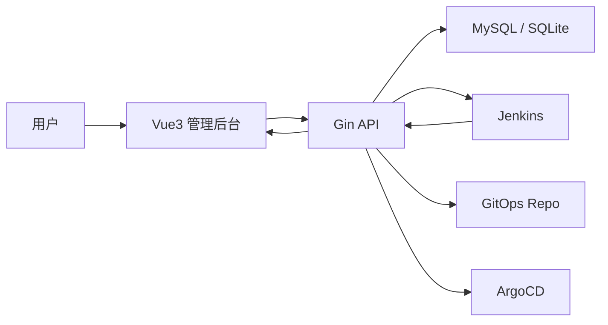

# GOS

轻量级内部发布平台，面向应用治理、Jenkins / ArgoCD 接入与发布单执行场景。

## 项目定位

GOS 不是 Jenkins 或 ArgoCD 的替代品，而是它们上层的发布治理层：

- 平台负责：应用模型、参数标准化、权限控制、发布入口、审计与展示
- Jenkins 负责：CI 流水线执行、构建日志、阶段进度
- ArgoCD / GitOps 负责：声明式部署、Sync 与集群落地

当前仓库已经落地了应用管理、Jenkins 接入、ArgoCD / GitOps 管理、发布模板、发布单、用户与权限体系，并提供 Vue3 管理后台与 Gin API。

## 核心能力

### 应用管理

- 应用 CRUD
- 应用负责人绑定
- 应用与 CI 管线绑定
- 标准字库管理（平台标准参数）

### Jenkins 管理

- Jenkins 管线自动同步 / 手动同步
- Jenkins 执行器参数同步
- 管线列表展示
- 原始脚本查看
- 原始链接跳转
- 原始 Jenkins Pipeline 创建 / 编辑 / 删除

### 发布管理

- 发布模板管理
- 发布单创建、详情、执行、取消
- 发布单回滚建单
- 发布参数快照
- 发布取值进度
- 发布执行步骤
- Jenkins 构建日志流式展示
- Jenkins 阶段进度展示
- ArgoCD / GitOps CD 聚合进度展示

### ArgoCD / GitOps 管理

- ArgoCD Application 列表与详情
- ArgoCD 手动同步
- GitOps 仓库状态查看
- GitOps 提交信息模版配置
- Helm values 驱动的 GitOps 发布模型（当前按平台文件收口）

### 系统管理

- 本地账号密码登录
- 用户管理
- 权限授权
- 发布环境设置
- 应用级可见 / 发布权限控制

## 技术栈

- 后端：Go、Gin、MySQL / SQLite、Swagger
- 前端：Vue 3、Vite、TypeScript、Pinia、Ant Design Vue
- 执行器：Jenkins、ArgoCD / GitOps（已接入）

## 架构概览



后端目录遵循较轻量的领域分层：

- `internal/domain`：领域实体与仓储接口
- `internal/application`：用例编排
- `internal/infrastructure`：Jenkins、数据库、配置
- `internal/interfaces/http`：Gin 路由与 Handler

## 功能模块

| 模块 | 当前能力 |
| --- | --- |
| 应用管理 | 我的应用、管线绑定、标准字库 |
| 组件管理 | Jenkins、执行器参数、ArgoCD、GitOps |
| 发布管理 | 发布单、发布模板、回滚、日志、取值进度、CD 聚合进度 |
| 系统管理 | 用户管理、权限授权、发布环境设置 |

## 快速开始

### 1. 环境要求

- Go `1.25+`
- Node.js `20+`
- MySQL `8+`（推荐）或 SQLite
- Jenkins（需要时启用）

### 2. 克隆仓库

```bash
git clone <your-repo-url>
cd gos
```

### 3. 配置后端

本项目通过配置文件启动，默认读取：

- `configs/config.local.json`

建议先根据实际环境调整以下配置：

- `database.driver`
- `database.mysql_dsn`
- `jenkins.enabled`
- `jenkins.base_url`
- `jenkins.username`
- `jenkins.api_token`
- `argocd.enabled`
- `argocd.base_url`
- `argocd.token`
- `gitops.enabled`
- `gitops.local_root`
- `gitops.commit_message_template`
- `auth.admin_username`
- `auth.admin_password`

也支持通过环境变量覆盖关键配置，详见：

- `configs/README.md`

### 4. 启动后端

```bash
APP_CONFIG_FILE=configs/config.local.json go run ./cmd/server
```

默认本地服务监听：

- `http://127.0.0.1:8081`

Swagger 文档：

- `http://127.0.0.1:8081/swagger/index.html`

### 5. 启动前端

```bash
cd frontend
npm install
npm run dev
```

默认开发地址：

- `http://127.0.0.1:5174`

如果你已经按项目配置开放了监听地址，也可以通过局域网 IP 直接访问。

## 默认账号

本地默认管理员账号由配置文件决定，常见本地配置为：

- 用户名：`admin`
- 密码：`admin123`

生产环境务必修改。

## 常用页面

- 登录页：`/login`
- 我的应用：`/applications`
- Jenkins 管线列表：`/components/jenkins`
- 执行器参数：`/components/executor-params`
- ArgoCD 管理：`/components/argocd`
- GitOps 管理：`/components/gitops`
- 发布单：`/releases`
- 发布模板：`/release-templates`
- 系统设置：`/system/settings`
- 用户管理：`/system/users`
- 权限授权：`/system/permissions`

## 数据库说明

当前核心业务表包括：

- `application`
- `pipeline`
- `executor_param_def`
- `platform_param_dict`
- `app_pipeline_binding`
- `binding_param_rule`
- `release_template`
- `release_template_param`
- `release_order`
- `release_order_param`
- `release_order_step`
- `release_order_execution`
- `release_order_pipeline_stage`
- `argocd_application`
- `sys_user`
- `sys_permission`
- `sys_user_permission`
- `sys_user_session`

服务启动时会自动初始化和迁移当前需要的表结构。

## 文档索引

- 后端需求文档：`docs/后端/`
- 前端需求文档：`docs/前端/`
- 前端样式规范：`docs/样式规范/`
- Swagger 产物：`docs/swagger.yaml`

推荐从以下文档继续了解当前进度：

- `docs/后端/后端需求v0.0.11.md`
- `docs/前端/前端需求v0.0.11.md`
- `docs/后端/后端需求v0.1.md`
- `docs/前端/前端需求v0.1.md`

## 项目结构

```text
gos/
├── cmd/server                  # 应用入口
├── configs                     # 配置文件
├── docs                        # Swagger 与需求文档
├── frontend                    # Vue3 前端
├── internal/application        # 用例层
├── internal/bootstrap          # 启动与配置
├── internal/domain             # 领域层
├── internal/infrastructure     # 基础设施层
└── internal/interfaces/http    # Gin 接口层
```

## 开发建议

- 优先使用 MySQL 作为主存储，SQLite 更适合本地演示
- Jenkins 参数较多时，手动同步可能耗时较长，建议结合定时同步使用
- 发布、权限、模板相关变更后，建议同时验证前后端链路

## Roadmap

后续可继续演进的方向：

- 生产孤岛 Agent 接入
- 平台托管 Shell 脚本执行与变量渲染
- CI/CD 双执行单元模板进一步收口
- 发布审批流
- 更细粒度的日志与阶段回放
- 外部身份源接入（LDAP / SSO）

## License

内部项目，按团队实际规范使用。
