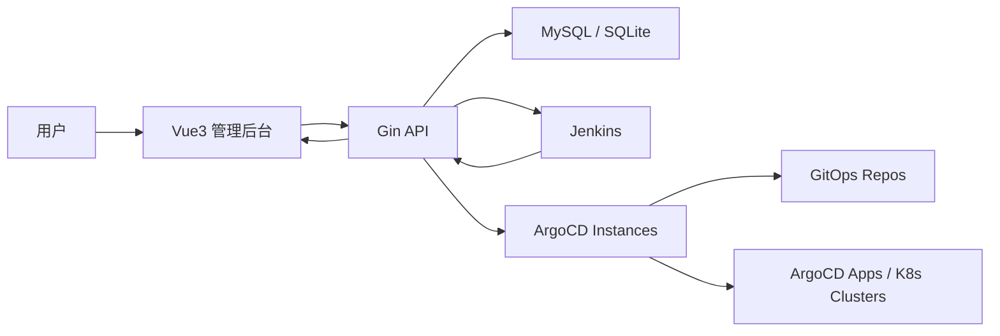
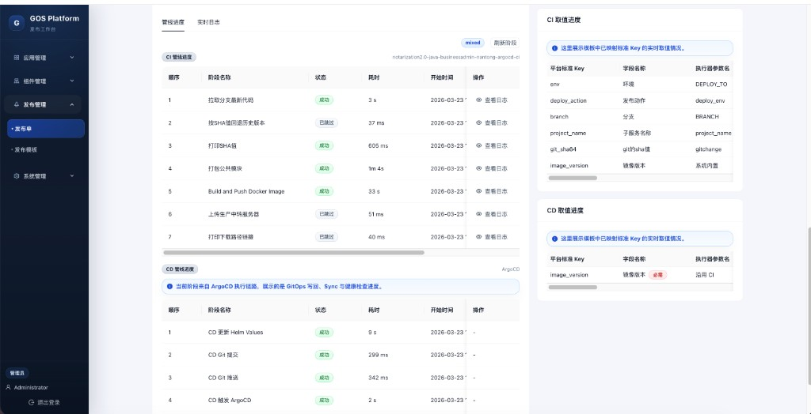

# GOS

轻量级内部发布平台，面向应用治理、Jenkins / ArgoCD 接入与发布单执行场景。

## Docker 发布与运行（推荐）

如果你要直接发布镜像并在目标机器上单容器运行，可以优先使用下面这组命令。

### 1. 推送镜像

```bash
docker push xx/gos-release:v1.0
```

### 2. 运行容器

```bash
docker run -d \
  --name gos-release \
  -p 2445:5174 \
  -e GOS_DB_DRIVER=mysql \
  -e GOS_MYSQL_DSN='xx:xx@tcp(xx:3306)/deploy_platform?charset=utf8mb4&parseTime=true&loc=UTC' \
  -e GOS_JENKINS_ENABLED=true \
  -e GOS_JENKINS_BASE_URL='http://xx:8000/' \
  -e GOS_JENKINS_USERNAME='xx' \
  -e GOS_JENKINS_API_TOKEN='xx' \
  -e GOS_AUTH_ADMIN_USERNAME='admin' \
  -e GOS_AUTH_ADMIN_PASSWORD='xx' \
  -e GOS_SECURITY_ENCRYPTION_KEY='xx' \
  -v /data/deploy-manifests:/gitops/deploy-manifests \
  -e GOS_GITOPS_PATH_MAPS='/data/deploy-manifests=/gitops/deploy-manifests' \
  xx/gos-release:v1.0
```

### 3. 访问地址

- 平台入口：`http://127.0.0.1:2445`
- 登录账号：`admin / xx`

这套运行方式会：

- 容器内同时提供前端和后端服务
- 通过单端口 `2445` 对外访问
- 复用宿主机 GitOps 目录 `<gitops-dir>`

## 项目定位

GOS 不是 Jenkins 或 ArgoCD 的替代品，而是它们上层的发布治理层：

- 平台负责：应用模型、参数标准化、权限控制、发布入口、审计与展示
- Jenkins 负责：CI 流水线执行、构建日志、阶段进度
- ArgoCD / GitOps 负责：声明式部署、Sync 与集群落地

当前仓库已经落地了应用管理、Jenkins 接入、ArgoCD / GitOps 管理、发布模板、发布单、用户与权限体系，并提供 Vue3 管理后台与 Gin API。

## 核心能力

### 应用管理

- 应用 CRUD
- 应用负责人绑定
- 应用与 CI 管线绑定
- 标准字库管理（平台标准参数）
- 我的应用页内置“发布流程介绍”抽屉，任何已登录用户可查看发布链路说明

### Jenkins 管理

- Jenkins 管线自动同步 / 手动同步
- Jenkins 执行器参数同步
- 管线列表展示
- 原始脚本查看
- 原始链接跳转
- 原始 Jenkins Pipeline 创建 / 编辑 / 删除

### 发布管理

- 发布模板管理
- 发布单创建、详情、执行、取消
- 发布单回滚建单
- 发布参数快照
- 发布取值进度
- CI / CD 双执行单元视图
- 发布详情基础信息、执行状态、步骤、日志统一查看
- 发布执行步骤
- Jenkins 构建日志流式展示
- Jenkins 阶段进度展示
- ArgoCD / GitOps CD 聚合进度展示

### ArgoCD / GitOps 管理

- ArgoCD 实例管理（支持多实例 / 多集群）
- ArgoCD 环境绑定（`env -> ArgoCD 实例`）
- ArgoCD 实例关联 GitOps 实例（`ArgoCD -> GitOps`）
- ArgoCD Application 列表与详情
- ArgoCD 手动同步
- GitOps 实例管理（支持多仓库工作目录）
- GitOps 仓库状态查看
- GitOps 提交信息模版配置
- Helm values 驱动的 GitOps 发布模型（当前按平台文件收口）
- 运行时自动解析链路：`env -> ArgoCD 实例 -> GitOps 实例 -> Git 仓库`

### 系统管理

- 本地账号密码登录
- 用户管理
- 权限授权
- 发布环境设置
- 应用级可见 / 发布权限控制

## 技术栈

- 后端：Go、Gin、MySQL / SQLite、Swagger
- 前端：Vue 3、Vite、TypeScript、Pinia、Ant Design Vue
- 执行器：Jenkins、ArgoCD / GitOps（已接入）

## 架构概览



后端目录遵循较轻量的领域分层：

- `internal/domain`：领域实体与仓储接口
- `internal/application`：用例编排
- `internal/infrastructure`：Jenkins、数据库、配置
- `internal/interfaces/http`：Gin 路由与 Handler

## 功能模块

| 模块 | 当前能力 |
| --- | --- |
| 应用管理 | 我的应用、发布流程介绍、管线绑定、标准字库 |
| 组件管理 | Jenkins、执行器参数、多 ArgoCD 实例、多 GitOps 实例、环境绑定 |
| 发布管理 | 发布单、发布模板、回滚、日志、取值进度、CI/CD 双执行单元、CD 聚合进度、显式 CD 类型切换 |
| 系统管理 | 用户管理、权限授权、发布环境设置 |

## 快速开始

### 1. 环境要求

- Go `1.25+`
- Node.js `20+`
- MySQL `8+`（推荐）或 SQLite
- Jenkins（需要时启用）

### 2. 克隆仓库

```bash
git clone <your-repo-url>
cd gos
```

### 3. 初始化数据库结构

首次部署 MySQL 时，建议先导入仓库中的表结构 SQL：

```bash
mysql -h xx -P 3306 -u xx -p < ./deploy_platform-20260323.sql
```

说明：

- `./deploy_platform-20260323.sql` 为当前仓库导出的最新表结构
- SQL 文件已包含 `CREATE DATABASE` 与 `USE deploy_platform`
- 导入完成后，再继续配置后端并启动服务

### 4. 配置后端

本项目通过配置文件启动，默认读取：

- `configs/config.local.json`

建议先根据实际环境调整以下配置：

- `database.driver`
- `database.mysql_dsn`
- `security.encryption_key`
- `jenkins.enabled`
- `jenkins.base_url`
- `jenkins.username`
- `jenkins.api_token`
- `release.env_options`
- `release.concurrency.*`
- `auth.admin_username`
- `auth.admin_password`

### 5. 启动后端

```bash
go run ./cmd/server
```

如需显式指定配置文件：

```bash
go run ./cmd/server -config configs/config.production.json
```

默认本地服务监听：

- `http://127.0.0.1:8081`

Swagger 文档：

- `http://127.0.0.1:8081/swagger/index.html`

### 6. 启动前端

```bash
cd frontend
npm install
npm run dev
```

默认开发地址：

- `http://127.0.0.1:5174`

如果你已经按项目配置开放了监听地址，也可以通过局域网 IP 直接访问。

## Docker 单容器启动

如需直接起一个同时包含前端与后端的容器，可参考：

```bash
cd /Users/lingyunxieqing/Desktop/gos
docker build -t gos-release:latest .
docker run -d \
  --name gos-release \
  -p 5174:5174 \
  -p 8081:8081 \
  -e GOS_DB_DRIVER=mysql \
  -e GOS_MYSQL_DSN='xx:xx@tcp(xx:3306)/deploy_platform?charset=utf8mb4&parseTime=true&loc=Local' \
  -e GOS_JENKINS_ENABLED=true \
  -e GOS_JENKINS_BASE_URL='http://xx:8000/' \
  -e GOS_JENKINS_USERNAME='xx' \
  -e GOS_JENKINS_API_TOKEN='xx' \
  -e GOS_AUTH_ADMIN_PASSWORD='xx' \
  -e GOS_SECURITY_ENCRYPTION_KEY='xx' \
  -v /data/deploy-manifests:/gitops/deploy-manifests \
  -e GOS_GITOPS_PATH_MAPS='/data/deploy-manifests=/gitops/deploy-manifests' \
  gos-release:latest
```

更多说明见：`/Users/lingyunxieqing/Desktop/gos/docs/部署/Docker部署说明.md`

## 默认账号

管理员账号由配置文件决定，默认用户名为：

- 用户名：`admin`
- 密码：由 `configs/config.local.json` 或 `configs/config.production.json` 中的 `auth.admin_password` 指定

生产环境务必配置强密码与独立加密密钥。

## 常用页面

- 登录页：`/login`
- 我的应用：`/applications`
- Jenkins 管线列表：`/components/jenkins`
- 执行器参数：`/components/executor-params`
- ArgoCD 管理：`/components/argocd`
- GitOps 管理：`/components/gitops`
- 发布单：`/releases`
- 发布模板：`/release-templates`
- 系统设置：`/system/settings`
- 用户管理：`/system/users`
- 权限授权：`/system/permissions`

## 发布流程介绍

“我的应用”页右上角提供 `发布流程介绍` 按钮，点击后会在右侧抽屉中展示当前平台的发布关系图，帮助用户理解：

- 应用 App
- CI 管线
- 发布参数
- CD 方式（管线 / ArgoCD）
- ArgoCD 实例
- GitOps 实例
- Git 仓库
- 目标集群

该入口对任何已登录用户可见，不依赖应用管理权限。

## 发布详情视图

当前发布单详情页已经按“执行单元”来组织查看体验，便于快速判断问题落在 CI 还是 CD：

- 基础信息：发布单号、创建时间、应用、模板、环境、Git 版本、镜像版本
- 执行单元：分别展示 `CI 执行单元` 和 `CD 执行单元` 的执行器、状态、开始/结束时间
- 取值进度：展示标准 Key 的当前值、来源、状态、说明
- 执行步骤：按全局 / CI / CD 维度展示步骤时间线
- 日志与阶段进度：Jenkins 日志流、Jenkins 阶段、ArgoCD / GitOps 聚合进度

其中 `CD=ArgoCD` 时，平台会优先展示：

- Helm values / GitOps 写回结果
- Git commit / push 结果
- ArgoCD Sync 与健康检查结果

如果 CD 在启动前失败，例如：

- 未解析到 `image_version`
- ArgoCD Application 不存在
- Git push 发生非 fast-forward 冲突

页面会直接在发布详情里展示失败原因，而不是只显示空白进度。

## 图例：状态与进度含义（驾驶舱式详情）

状态会在发布单详情页与列表页中用统一的“颜色/图标”表达：成功/执行中/待执行/失败/已取消。

下面截图为“图例”的实际呈现（以发布相关页面为例）：

发布单详情页（整体进度圆形图标 + CI/CD 执行单元状态）  


发布单列表页（状态筛选与状态标识）  


发布执行过程（CI/CD 阶段/取值进度状态标签）  


新建发布单页（选择应用、CI/CD、环境与基础参数）  


我的应用页（环境状态与发布入口）  


发布模板弹窗（CI 配置 / CD 配置切换与关键参数）  


## 数据库说明

当前核心业务表包括：

- `application`
- `pipeline`
- `executor_param_def`
- `platform_param_dict`
- `app_pipeline_binding`
- `binding_param_rule`
- `release_template`
- `release_template_param`
- `release_order`
- `release_order_param`
- `release_order_step`
- `release_order_execution`
- `release_order_pipeline_stage`
- `argocd_instance`
- `argocd_env_binding`
- `argocd_application`
- `gitops_instance`
- `sys_user`
- `sys_permission`
- `sys_user_permission`
- `sys_user_session`

服务启动时会自动初始化和迁移当前需要的表结构。

## 日志规范

当前后端业务日志统一采用结构化 `key=value` 风格，优先覆盖发布、模板、认证、ArgoCD、GitOps 等主链路。

- 统一字段：
  - `level`：日志级别
  - `component`：业务组件，例如 `release_order`、`argocd_cd`、`gitops_service`
  - `action`：动作名称，例如 `create_start`、`sync_application_success`
- 推荐打印时机：
  - 用例入口：`*_start`
  - 外部依赖调用成功：`*_success`
  - 外部依赖调用失败：`*_failed`
  - 可接受但需要关注的分支：`*_skipped` / `*_noop`
- 推荐补充字段：
  - 发布链路：`order_id`、`order_no`、`template_id`、`execution_id`、`pipeline_scope`
  - 配置链路：`instance_id`、`instance_code`、`binding_id`
  - GitOps 链路：`repo_url`、`branch`、`commit_sha`、`changed_files_count`
- 安全约束：
  - 不打印密码、Token、完整凭据
  - 会话 token 只允许打印脱敏后的尾缀
  - 不在日志中输出带鉴权信息的 Git remote URL

日志示例：

```text
level="INFO" component="release_order" action="create_success" order_id="ro-xxx" order_no="RO-20260320-xxxx" template_id="rt-xxx" env_code="dev"
level="ERROR" component="argocd_cd" action="sync_application_failed" error="argocd request failed: status=404 message=Not Found" order_id="ro-xxx" app_name="java-nantong-test-dev-gateway"
```

## 文档索引

- 后端需求文档：`docs/后端/`
- 前端需求文档：`docs/前端/`
- 前端样式规范：`docs/样式规范/`
- Swagger 产物：`docs/swagger.yaml`

推荐从以下文档继续了解当前进度：

- `docs/后端/后端需求v0.0.11.md`
- `docs/前端/前端需求v0.0.11.md`
- `docs/后端/后端需求v0.0.12.md`
- `docs/前端/前端需求v0.0.12.md`
- `docs/后端/后端需求v0.1.md`
- `docs/前端/前端需求v0.1.md`

## 项目结构

```text
gos/
├── cmd/server                  # 应用入口
├── configs                     # 配置文件
├── docs                        # Swagger 与需求文档
├── frontend                    # Vue3 前端
├── internal/application        # 用例层
├── internal/bootstrap          # 启动与配置
├── internal/domain             # 领域层
├── internal/infrastructure     # 基础设施层
└── internal/interfaces/http    # Gin 接口层
```

## 开发建议

- 优先使用 MySQL 作为主存储，SQLite 更适合本地演示
- Jenkins 参数较多时，手动同步可能耗时较长，建议结合定时同步使用
- 发布、权限、模板相关变更后，建议同时验证前后端链路

## Roadmap

后续可继续演进的方向：

- 生产孤岛 Agent 接入
- 平台托管 Shell 脚本执行与变量渲染
- CI/CD 双执行单元模板进一步收口
- 发布审批流
- 更细粒度的日志与阶段回放
- 外部身份源接入（LDAP / SSO）

## License

内部项目，按团队实际规范使用。
