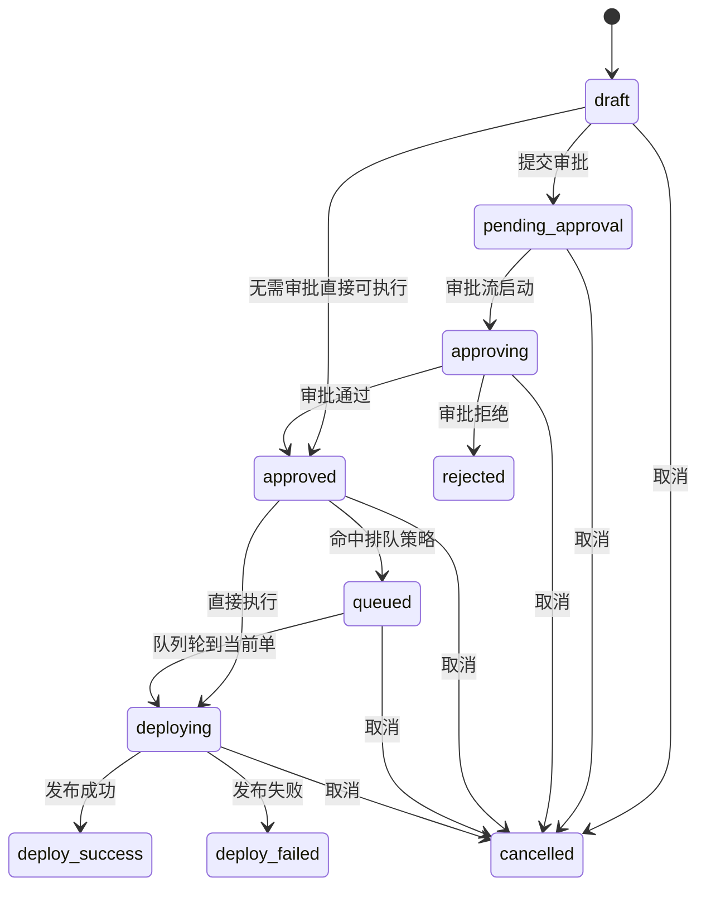

# 后端需求文档 v0.0.16（基于 v0.0.15 增量）

## 1. 文档信息
- 文档版本：`v0.0.16`
- 基线日期：`2026-03-25`
- 上一版本：`/Users/lingyunxieqing/Desktop/gos/docs/后端/后端需求v0.0.15.md`
- 本版主题：`发布业务状态机升级`
- 当前状态：`规划中`

## 2. 版本目标
当前后端更偏“执行状态机”：
- `pending`
- `running`
- `success`
- `failed`
- `cancelled`

这套状态足以驱动执行，但不够表达发布业务阶段。`v0.0.16` 的目标是把发布单升级为“业务状态机”，让审批、排队、执行、回滚、通知等能力都能基于同一套主状态工作。

## 3. 当前缺口
当前后端少了这些业务态：
- `draft`
- `pending_approval`
- `approving`
- `approved`
- `rejected`
- `queued`

当前问题：
1. `pending` 无法区分“草稿”、“待审批”、“审批通过待执行”。
2. `running` 无法区分“排队中”和“真正执行中”。
3. `success` 无法区分“审批成功”和“部署成功”。
4. 并发队列当前依赖前端/详情页派生，不利于审计和通知。

## 4. 目标主状态机
建议将 `release_order.status` 升级为以下枚举：

- `draft`
- `pending_approval`
- `approving`
- `approved`
- `rejected`
- `queued`
- `deploying`
- `deploy_success`
- `deploy_failed`
- `cancelled`

说明：
- `approved`：业务上允许执行，但尚未真正开始部署
- `queued`：已通过预检/审批，但正在等待锁或队列
- `deploying`：真正进入执行链路
- `deploy_success / deploy_failed`：部署终态

## 5. 状态流转建议

## 6. 分层状态设计
建议继续保留现有分层，只升级主状态语义：

### 6.1 主表状态
`release_order.status`
- 负责表达业务阶段

### 6.2 执行单元状态
`release_order_execution.status`
- 保持现有：
  - `pending`
  - `running`
  - `success`
  - `failed`
  - `cancelled`
  - `skipped`
- 继续负责表达 `CI/CD` 单元级执行进展

### 6.3 步骤状态
`release_order_step.status`
- 保持现有：
  - `pending`
  - `running`
  - `success`
  - `failed`

### 6.4 管线阶段状态
`release_order_pipeline_stage.status`
- 保持现有：
  - `pending`
  - `running`
  - `success`
  - `failed`
  - `cancelled`
  - `skipped`

说明：
- `v0.0.16` 的核心是“升级主状态机”，不是推翻执行层状态机。

## 7. 并发与排队状态要求
## 7.1 当前问题
目前“排队中”主要通过以下组合推导：
- `release_order.status = running`
- `execution.status = pending`
- `waiting_for_lock = true`

这会导致：
- 数据库主状态中看不出这张单在排队
- 通知、审计、列表筛选都要额外推导

## 7.2 目标
命中排队策略时，主状态应直接进入：
- `queued`

在此阶段：
- 执行单元可仍保持 `pending`
- 但主状态必须明确是 `queued`

## 7.3 队列恢复执行
当锁释放或轮到当前单时：
- `queued -> deploying`

不允许再由前端自行推测“排队中”，而是由后端主状态直接给出。

## 8. 审批状态要求
虽然 `v0.0.16` 不强制要求审批流完整落地，但后端主状态机必须预留审批态：
- `pending_approval`
- `approving`
- `approved`
- `rejected`

建议：
- 即使当前版本暂不提供完整审批接口，也应完成：
  - 枚举定义
  - 状态映射
  - 兼容查询与渲染字段

这样后续审批流不会再引发主状态重构。

## 9. 数据库改造建议
## 9.1 `release_order`
建议将 `status` 枚举语义升级到新状态机。

同时建议补充：
- `approval_status`（可选）
- `queue_position`
- `queued_at`
- `approved_at`
- `approved_by`
- `rejected_at`
- `rejected_by`
- `rejected_reason`

说明：
- 若不想把审批细节全部塞进主表，可拆审批记录表。
- 但 `queued_at / queue_position` 建议保留在主表或高频聚合表中，方便列表查询。

## 9.2 审批记录表（建议新增）
建议新增：`release_order_approval_record`

字段建议：
- `id`
- `release_order_id`
- `release_order_no`
- `status`
- `action`
- `approver_user_id`
- `approver_name`
- `comment`
- `created_at`

## 9.3 队列表（可选）
若未来队列模型复杂化，建议新增：`release_order_queue_record`

字段建议：
- `id`
- `release_order_id`
- `batch_no`
- `queue_scope`
- `queue_key`
- `queue_position`
- `status`
- `created_at`
- `updated_at`

当前阶段若不单独建表，也至少要让：
- `queued`
- `queue_position`
可稳定查询。

## 10. 接口改造建议
## 10.1 读接口
以下接口返回值需升级：
- `GET /release-orders`
- `GET /release-orders/:id`
- `GET /release-orders/:id/concurrent-progress`

建议新增或补充字段：
- `status`
- `business_status`
- `queue_position`
- `queued_reason`
- `approval_status`
- `can_execute`
- `can_cancel`
- `can_rollback`

## 10.2 写接口
后续需要支持：
- `POST /release-orders/:id/submit-approval`
- `POST /release-orders/:id/approve`
- `POST /release-orders/:id/reject`

即使本版不落审批页面，也建议先在 usecase 层预留状态流转能力。

## 11. 与旧状态机的兼容映射
迁移期间建议提供统一映射：

- `pending` -> `approved`
- `running + waiting_for_lock` -> `queued`
- `running + has_running_execution` -> `deploying`
- `success` -> `deploy_success`
- `failed` -> `deploy_failed`
- `cancelled` -> `cancelled`

说明：
- 该映射仅用于迁移阶段。
- 新建数据应直接写新状态，而不是长期依赖旧状态推导。

## 12. 通知与审计影响
通知事件建议升级为业务态事件：
- `approval_pending`
- `approval_approved`
- `approval_rejected`
- `deploy_queued`
- `deploy_started`
- `deploy_success`
- `deploy_failed`
- `deploy_cancelled`

审计要求：
- 记录状态从什么变成什么
- 记录是谁触发了审批、执行、取消、回滚
- 记录排队原因、排队位次、释放锁来源

## 13. 执行链路调整建议
## 13.1 创建发布单
- 默认可创建为：
  - `draft`
  - 或 `approved`
- 是否需要审批由模板/环境配置决定

## 13.2 点击发布
- 仅允许：
  - `approved`
  状态进入执行
- 若命中队列：
  - `approved -> queued`
- 若可直接执行：
  - `approved -> deploying`

## 13.3 执行完成
- 成功：
  - `deploying -> deploy_success`
- 失败：
  - `deploying -> deploy_failed`

## 13.4 并发批次
- 同 app 同 env 且命中排队策略时：
  - 主状态必须写成 `queued`
- 不允许再出现“主状态 failed，但详情解释说其实在排队”的混乱结果

## 14. 验收标准
后端完成后，需要满足：
1. 后端主状态能直接区分：
   - 草稿
   - 待审批
   - 审批通过
   - 排队中
   - 发布中
   - 发布成功
   - 发布失败
2. 并发队列中的单主状态必须是 `queued`，而不是 `running` 或 `failed`
3. 查询接口不需要前端额外推导，已可直接返回业务态
4. 批次进度、详情页、通知事件三处状态语义一致
5. 旧状态到新状态的迁移路径明确，兼容期内不出现双重口径
